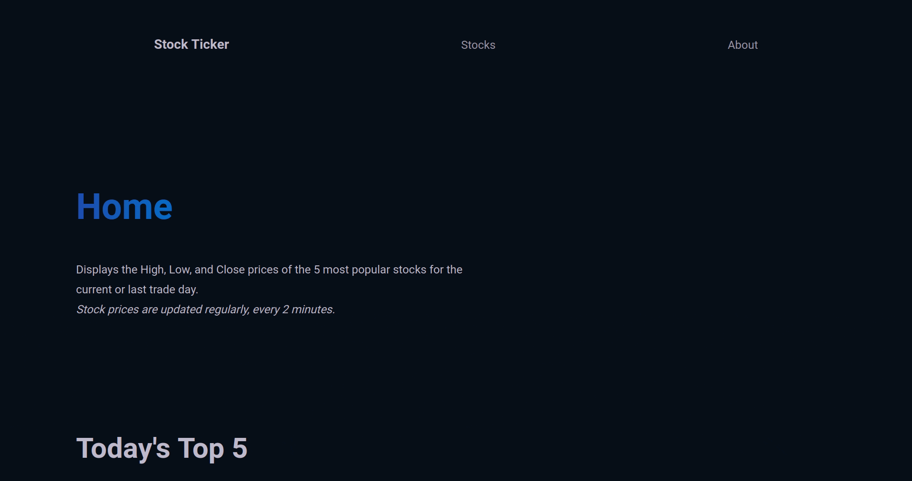

## Real-Time Stock Ticker

An application that uses SocketIo Websockets to stream the current, high, and low prices of the top 5 stocks. Built with NextJs and Express.

Visit it [here](https://stock-ticker.onrender.com/)

## Project Demos

## Installation and Setup

- Clone or download the repository. You will need `node` and `npm` installed globally on your machine.

### Backend

- Move into the backend directory
- Run `npm install` to install all of the dependencies
- If using `Node`, run `node dist/server.js`, if using nodemon run `nodemon server.ts`
- To compile, use the command `npm run build`. **DO NOT USE TSC --WATCH**
- To run the tests, `npm test`

- The backend can be accessed at `localhost:8000` by default

## Frontend

- Move into the frontend directory
- Run `npm install` to install all of the dependencies
- To start the server, run `npm run dev`
- To run cypress, use `npm run cypress`

- The frontend can be accessed at `localhost:3000` by default

## Reflection

Originally, I wanted to build an application that allowed users to communicate in real time in multiple chat rooms. This felt too generic and was too similar to other projects, particularly in tech stack.

Using various tools, I was able to determine the scope and scale of the project rather quickly, minizing the time spent on tedious and somewhat boring prep work.
I determined that I would use `NextJs` for the first time, and on the backend I would use `SocketIo` to stream data from an API to the frontend so that no database would be used.

The main challenge of this project was determining how to effectively implement the third-party API along with Websockets. How many calls would I make? How often would I make them? Both of these factors were severly limiting in terms of what API's I could use, and how I could use them.

Figuring out how to implement a data stream without a database had some challenges as well. New users connecting would have to wait untill a new batch of data was sent to even see the stock prices at all. Data Caching solved this problem quite easily, allowing me to store the last set of data so it can be sent to new users.

The technologies implemented in this projects are `NextJs`, `NodeJs`, `ExpressJs`, `TypeScript`, `SocketIo`, and `PuppeteerJs`.
